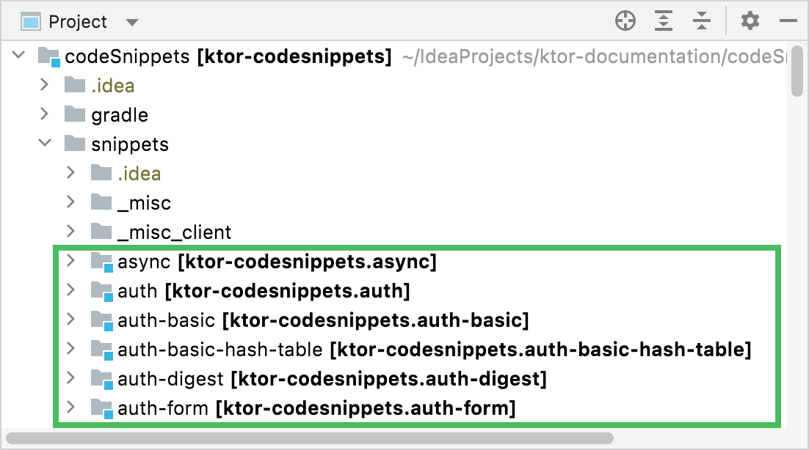
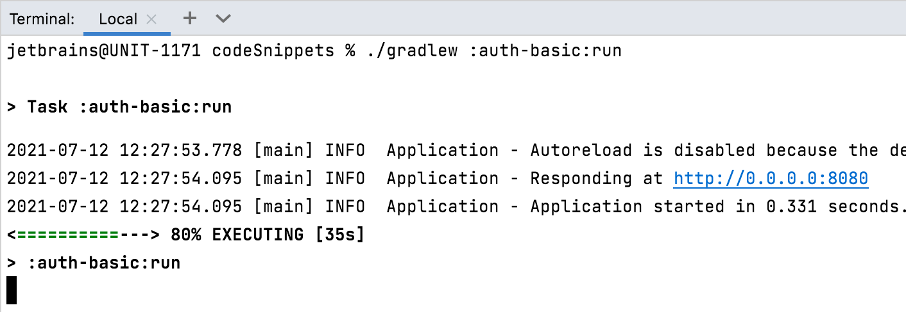

# Ktor code examples

The `codeSnippets` folder of a Ktor documentation repository contains a Gradle project with runnable code examples that show how to work with various Ktor plugins. Code from these examples are [referenced](#referencing-code-snippets) in corresponding documentation sections. 

You can run any of these examples in IntelliJ IDEA in the following way:
1. [Clone](https://www.jetbrains.com/help/idea/manage-projects-hosted-on-github.html#clone-from-GitHub) a [Ktor documentation repository](https://github.com/ktorio/ktor-documentation).
2. [Open](https://www.jetbrains.com/help/idea/import-project-or-module-wizard.html) the `codeSnippets` folder and wait until IntelliJ IDEA imports a Gradle project with code examples. You can see all the examples in a [Project view](https://www.jetbrains.com/help/idea/project-tool-window.html) by expanding the [snippets](snippets) folder.
   
   
   
   Each example has its own `README` file with instructions on how to run it.
3. To run an example, you can use a **run** Gradle task that depends on an example location. For example, to run an example demonstrating basic HTTP authentication (the [snippets/auth-basic](snippets/auth-basic) folder), open the `codeSnippets` folder in a [terminal](https://www.jetbrains.com/help/idea/terminal-emulator.html) and execute the following command:

   ```bash
   ./gradlew :auth-basic:run
   ```

   Wait until IntelliJ IDEA builds and runs an example.
   
   
   
   

## Referencing code snippets
To display a specific source file in a Markdown topic, use the `src` attribute as follows:
````
```kotlin
```
{src="snippets/autohead/src/main/kotlin/com/example/Application.kt"}
````
If you want to display only a specific function from this source file, use the `include-symbol` attribute:
````
```kotlin
```
{src="snippets/autohead/src/main/kotlin/com/example/Application.kt" include-symbol="main"}
````