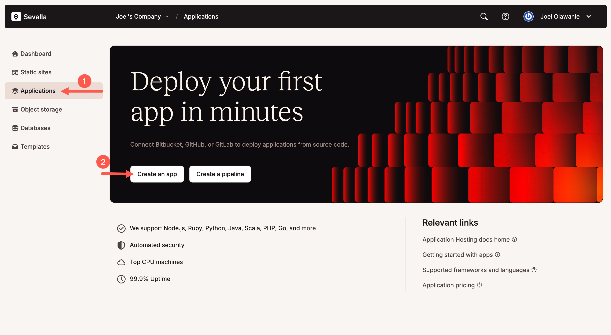
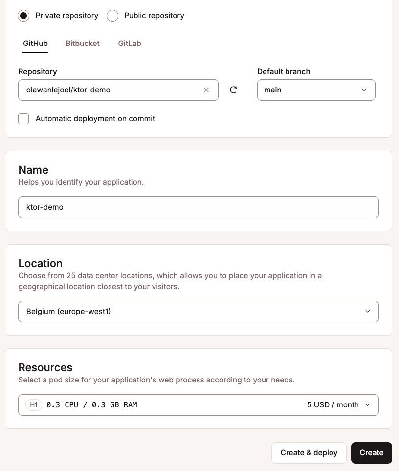
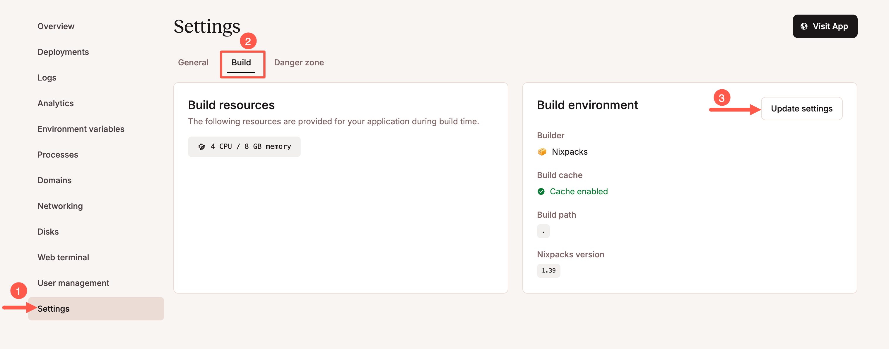
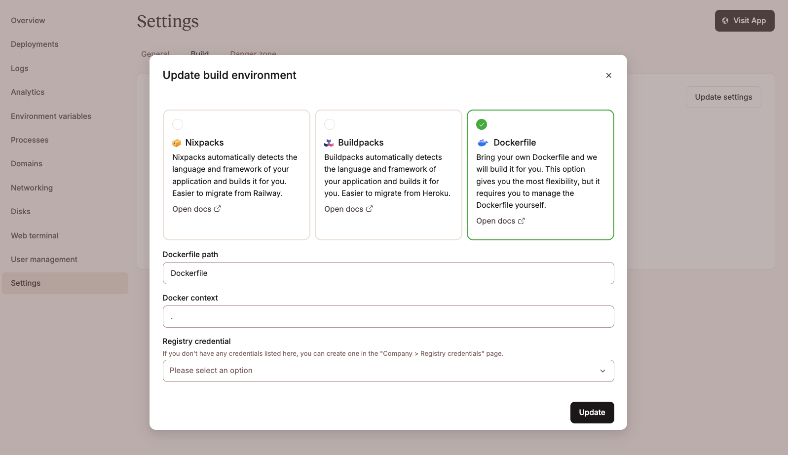

[//]: # (title: Sevalla)

<show-structure for="chapter" depth="2"/>

<link-summary>Learn how to prepare and deploy a Ktor application to Sevalla.</link-summary>

In this tutorial, you will learn how to prepare and deploy a Ktor application to [Sevalla](https://sevalla.com/). You can use one of the following initial projects, depending on the way used to [create a Ktor server](server-create-and-configure.topic):

* [embedded-server](https://github.com/ktorio/ktor-documentation/tree/%ktor_version%/codeSnippets/snippets/embedded-server)

* [Engine-main](https://github.com/ktorio/ktor-documentation/tree/%ktor_version%/codeSnippets/snippets/engine-main)

## Prerequisites {id="prerequisites"}

Before starting this tutorial, you need to [create a Sevalla account](https://sevalla.com) (comes with $50 in free credits).

## Clone a sample application {id="clone-sample-app"}

To open a sample application, follow the steps below:

1. Clone the [Ktor documentation repository](https://github.com/ktorio/ktor-documentation).
2. Open the [codeSnippets](https://github.com/ktorio/ktor-documentation/tree/%ktor_version%/codeSnippets) project.
3. Open the [embedded-server](https://github.com/ktorio/ktor-documentation/tree/%ktor_version%/codeSnippets/snippets/embedded-server) or [engine-main](https://github.com/ktorio/ktor-documentation/tree/%ktor_version%/codeSnippets/snippets/engine-main) sample, which demonstrates two different approaches to setting up a Ktor server — either by configuring it directly in code or through an external configuration file. The only difference in deploying these projects is how to specify a port used to listen for incoming requests.

## Prepare the application {id="prepare-app"}

### Step 1: Configure the port {id="port"}

Sevalla injects a random port using the `PORT` environment variable. Your application must be configured to listen on that port.

If you've chosen the [embedded-server](https://github.com/ktorio/ktor-documentation/tree/%ktor_version%/codeSnippets/snippets/embedded-server) sample with server configuration specified in code, you can obtain the environment variable value using `System.getenv()`. Open the <path>Application.kt</path> file placed in the <path>src/main/kotlin/com/example</path> folder and change the port parameter value of the `embeddedServer()` function as shown below:

```kotlin
fun main() {
    val port = System.getenv("PORT")?.toIntOrNull() ?: 8080
    embeddedServer(Netty, port = port, host = "0.0.0.0") {
        // ...
    }.start(wait = true)
}
```

If you've chosen the [engine-main](https://github.com/ktorio/ktor-documentation/tree/%ktor_version%/codeSnippets/snippets/engine-main) sample with server configuration specified in the <path>application.conf</path> file, you can assign the environment variable to the port parameter by using the `${ENV}` syntax. Open the <path>application.conf</path> file placed in <path>src/main/resources</path> and update it as shown below:

```hocon
ktor {
  deployment {
    port = 5000
    port = ${?PORT}
  }
  application {
    modules = [ com.example.ApplicationKt.module ]
  }
}
```

### Step 2: Add a Dockerfile {id="dockerfile"}

To build and run your Ktor project on Sevalla, you need a Dockerfile. Here’s a sample Dockerfile using a multi-stage build:

```docker
# Stage 1: Build the app
FROM gradle:8.5-jdk17-alpine AS builder
WORKDIR /app
COPY . .
RUN gradle installDist

# Stage 2: Run the app
FROM eclipse-temurin:17-jre-alpine
WORKDIR /app
COPY --from=builder /app/build/install/<project-name>/ ./
ENV PORT=8080
CMD ["./bin/<project-name>"]
```

Make sure to replace `<project-name>` with the project name defined in your <path>settings.gradle.kts</path> file:

```kotlin
rootProject.name = "ktor-app"
```

## Deploy the application {id="deploy-app"}

Sevalla builds and deploys your application directly from a connected Git repository. This can be hosted on platforms like GitHub, GitLab, Bitbucket, or any supported Git provider. To deploy successfully, ensure your project is committed and pushed, and includes all necessary files (such as your Dockerfile, <path>build.gradle.kts</path>, and source code).

To deploy the application, sign in to [Sevalla](https://sevalla.com/) and follow the steps below:

1. Click **Applications -> Create an app**
  
2. Choose your Git repository and select the appropriate branch (usually `main` or `master`).
3. Set the **application name**, select a **region**, and choose your **pod size** (you can start with 0.5 CPU / 1GB RAM).
4. Click **Create**, but skip the deploy step for now  
  
5. Go to **Settings -> Build** and click **Update Settings** under the **Build environment** card.  
  
6. Set the build method to **Dockerfile**.
  
7. Confirm the **Dockerfile path** is `Dockerfile` and the **Context** is `.`.
8. Return to your application's **Deployment** tab and click **Deploy**.

Sevalla will clone your Git repository, build the Docker image using your Dockerfile, inject the `PORT` environment variable, and run your application. If everything is configured correctly, your Ktor app will be live at `https://<your-app>.sevalla.app`.